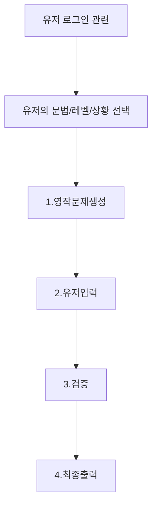

---

"본 프로젝트는 단순한 학습 기록 이상의 AI 엔지니어로의 커리어 확장을 위해 시스템 설계부터 최적화까지 상용 서비스급 파이프라인을 직접 구현한 '지능형 영어 학습 에이전트' 의 기술 명세 및 성과를 담고 있다."

# GRAMMAR DOG
*학습자의 문법 오류를 집요하게 추적하여 교정한다는 의미*

## 학습 & 구현 방법

'AI엔지니어링' 이라는 생소한 분야에 무작정 뛰어들기보다, 우선 관련 서적들을 정독하며 개념적 뼈대를 세웠다. 각기 다른 난이도의 정보들을 나만의 관점으로 큐레이션한 뒤, Gemini 와 머리를 맞대고 실무에 필요한 지식을 빠르게 흡수하며 '상용급 배포'를 위한 사전 준비를 마쳤다.

### [[바이브코딩]]
해당 프로젝트에 필요한 기술의 범위는 상당히 넓고 깊었다. 여전히 직접 코딩하는 감각을 선호하지만, 시대는 변했고 코딩 그 자체는 이미 AI가 인간의 능력을 뛰어넘었다. 굳이 타자 연습이 필요한 상황이 아니라면 손코딩은 최소화하기로 결정했다. 빠르게 상용화 수준의 결과물을 내야했고, 시간적 제약도 무시할 수 없었다. 이미 기존 강의나 업무에서 AI를 폭넓게 활용해 왔기에 이 방식은 익숙하고 능숙했다.

기존에 사용하던 '[[VSCode]]' 와 '[[Copilot]]' 환경을 넘어, 전면적인 [[바이브코딩]]을 위한 툴 셋팅을 마쳤다. 바로 '[[Cursor]]'와 최근 주목받는 코딩 전문 에이전트 '[[Antigravity]]'이다. 두 도구는 비슷해 보이지만 각각의 장단점이 뚜렷하며, 이를 적재적소에 배치하는 과정은 흥미로운 경험이었다. 

[[바이브코딩]]은 작업 범위에 따라 상당량의 비용이 수반된다. 문맥을 이해하고 유저 정보를 입력받아 로직을 출력하는 모든 액션은 [[토큰]]이라 불리는 리소스를 소비한다. 이 토큰이 곧 비용과 직결된다. 바이브코딩 헤비 유저들이 이 토큰을 아끼기 위해 온갖 전략을 구사하는 이유도 여기에 있다. 

## 구현 계획

초기 설계는 아래와 같이 진행했다. 
``` markdown
[개요]
- 이 프로젝트는 AI 엔지니어링 공부 진행중 만드는 사이드 프로젝트이다.
- 결과물은 테스트용이 아닌 상용 레벨급으로 만들 예정
- 프롬프트 규칙 떡칠을 지양한다.
- 최신 상용화 트렌드에 맞게 아키텍처를 설계
- 영어문장 만들기와 튜터링에 특화된 어플리케이션을 만든다.
- 어플리케이션의 메인 기능은 문장 만들기와, 문법 공부이다.

[흐름 구성]
1. 유저가 일상, 업무, 여행 등의 카테고리를 선택한후
2. 시스템이 랜덤하게 상황을 부여함. (혹은 선택)
3. 사용자 레벨에 맞게 한글로 문장을 제시함.
4. 그 문장을 유저가 영작으로 작성함.
5. 시스템이 그 문장을 분석, 교정, 피드백 해줌.
6. 자주 틀리거나, 중요한 내용은 개인의 오답노트에 추가함.
7. 이런 루틴이 유저가 그만할때까지 무한 반복함
   
[기술스택]
front : react, next.js
backend : python, fastAPI
핵심기술 : Langchain, Langgraph 등의 프레임워크 사용 
DB : 임베딩을 위한 db선택(chroma, FAISS 등) 
고도화를 위한 기술 적용 : 청킹전략, 질의변형, 가상답변, 검색알고리즘최적화, 리랭킹, Self-RAG 모델 : LLM 급의 상용 API(사용료와 성능고려) 사용 (로컬 모델 사용 X)
   
```

최종 구현될 서비스의 흐름은 단순하다. 영작과 피드백이 교차하는 무한 반복 패턴이다. 그러나 이 간결한 흐름 이면에는 수많은 로직과 엔지니어링적 시행착오가 녹아들어야 했다. 우선 프런트엔드는 원활한 서비스 배포를 위해 [[Next.js]] 기반으로 구축한다. 배포는 [[Vecel]] 을 활용한다. AI 파트는 [[Python]]을 표준으로 삼아 [[LangChain]], [[LangGraph]] 등의 핵심 프레임워크를 활용했다. 백엔드는 프런트엔드와의 연동 효율을 고려해 [[FastAPI]] 를 채택했다. DB 선정 과정이 까다로웠는데, 초기에는 로컬 환경의 [[Chroma]]나 [[FAISS]]를 검토했으나 배포 편의성을 고려해 [[Supabase]]로 결정했다.([[PostgreSQL]]) 익숙한 [[RDB]] 형태를 유지하면서 일부 컬럼만 벡터 타입으로 구성하여 [[의미 기반 검색]] 에 활용하는 방식이 관리 측면에서 유리하다고 판단한다.


## 아이디어구상
"문제 생성 → 영작 → 피드백"으로 이어지는 단순한 순환 구조 내에서 어느 지점에 AI 엔지니어링 요소를 투입할 것인지가 관건이다. 범용 LLM 챗봇으로도 영어 학습은 충분히 가능하지만, 굳이 전용 서비스를 개발하는 이유는 명확하다. 개인화된 정보 활용(오답 노트 같은)과 특정 기능에 특화된 에이전트 구축, 그리고 실 서비스 구현을 통한 AI 엔지니어링 역량 강화가 그 목적이다.

설계 과정에서 가장 경계한 것은 '[[오버엔지니어링]]' 이다. 바닥부터 모델을 만드는 연구자가 아니기에, 잘 학습된 '[[베이스모델]]'(Closed Model)을 전략적으로 활용하는 방향을 잡는다. 모델 [[파인튜닝]]까지 염두에 두었으나, 이미 상용 모델들이 보유한 영어 구사 및 문법 분석 능력이 최상급이라는 포인트에 주목했다. 검증되지 않은 데이터로 무리하게 튜닝을 시도하기보다, 기존 모델의 성능을 아키텍처적으로 극대화하는 것이 본질적인 해결책이라 판단했기 때문이다. 

## 작업시작

1차 작업에서는 복잡한 구현을 과감히 뒤로 미루고, 핵심적인 흐름과 실현 가능성을 판단하는 데 주력했다. 초기에는 간결한 단계를 구상하였으나, 프로젝트가 후반부로 진행됨에 따라 단계별 구성 요소가 추가되면서 정교하고 거대한 그래프 구조로 확장되었다.





**아래는 4차 작업 시점의 구현 설계도이다. 초기버전의 설계에서 굉장히 복잡한 로직이 추가되었다.**


## 문서 로드 / 인덱싱
초기에는 특정 문법 서적이나 영작 가이드 문서를 기반으로 인덱싱을 수행하려 했으나, 그 필요성에 대해 본질적인 의문이 생겼다. LLM 자체가 이미 네이티브급의 언어 구사 능력을 보유하고 있으므로, 다시 언어를 학습시키거나 로드할 일이 없다고 판단했다. 특정 도메인이나 특별한 목적이 있는 경우가 아니라면, 인덱싱 과정을 제외하고 모델의 기본 지식을 활용하는 것이 아키텍처 측면에서 훨씬 효율적이라 판단했다.

## DB 작업
DB 작업의 경우 '오답 노트' 기능을 위해 필요했다. 단순히 오답을 기록하는 수준을 넘어, 사용자가 입력한 영작문이 오답일 경우 DB 내 유사 오류 사례를 검색하여 피드백의 깊이를 더하도록 설계하였다. 복습 모드 진입 시에는 축적된 오답 히스토리 테이블에서 문법 규칙과 [[의미 기반 검색]](Semantic Search)을 적절히 밸런싱하여 사용자 맞춤형 문제를 동적으로 생성한다.

DB 엔진 선정 과정에서는 로컬 테스트용인 [[Chroma]]나 [[FAISS]] 등도 후보군에 있었으나, 최종적으로는 배포 편의성과 운영 효율성을 고려해 [[Supabase]](PostgreSQL + pgvector)를 채택했다. 익숙한 RDB 인프라를 유지하면서 특정 컬럼만 벡터 타입으로 구성해 의미 기반 검색을 병행할 수 있다는 점이 결정적인 요인이었다. 이는 관리의 편의성을 최우선으로 하되, 필요에 따라 관계형 데이터와 벡터 데이터를 혼합하여 사용할 수 있는 실용적인 아키텍처를 구축하기 위함이다.
## 프롬프팅 주의사항
AI 개발 프로젝트에서 [[프롬프팅]]은 양날의 칼과 같다. 모델을 직접 수정하지 않고도, 결과물을 제어할 수 있는 가장 강력한 도구이지만, 그만큼 오용하기 쉽기 때문이다. 초기 개발 단계에서 대부분은 특정 기능이 의도대로 동작하지 않을 때마다 프롬프트에 세부 규칙을 계속해서 추가하는 실수를 범한다. 결과적으로 프롬프트에는 모든 케이스별 대응방법이 적혀있게 된다. 이는 관리 효율성을 급격히 저하시켰다.

이러한 방식의 위험성은 명확하다. 프롬프트는 일종의 명령어인데, 명령어가 비대해질수록 모델은 [[문맥]](Context)의 우선순위를 혼동하기 시작하며, 이는 곧 추론 비용의 상승 및 성능 저하로 이어진다. 

특히 이런 유형은 [[바이브코딩]] 과정에서 두드러지는데, 맥락 없는 추상적 명령으로 인해 모델을 더 빨리 지치게 만드는 경우들이 생긴다. 이를 해결하기 위해 프롬프트에 의존하는 비중을 줄이고, 대신 적극적으로 로직을 구현하고, 필터링된 정보를 넘겨 최소한의 프롬프팅을 해야한다.

## 고도화
[[RAG]] 기반 서비스를 상용 수준으로 고도화하기 위해 설계 관점에서 몇 가지 핵심 전략을 검토하고 적용했다. 단순히 최신 기술을 나열하는 것이 아니라, 프로젝트의 특성에 최적화된 방식을 선택하는 데 집중했다.

- **전략적 청킹(Strategic Chunking):** 단순히 길이를 기준으로 문서를 자르는 방식은 정보의 파편화를 초래하므로 지양해야한다. 대신 '문법 규칙'과 '핵심 예문'을 하나의 의미 단위로 묶어 저장함으로써 문맥 유실을 방지하는 '구조적 청킹'을 설계했다.(문서 임베딩이 필요없다고 판단하여 적용되지 못했다.) 특히 부모-자식 기반의 전략을 도입하여, 부모 문서는 약 1,000토큰(오버랩 200) 수준으로 구성해 RDB에서 관리하고, 자식 문서는 임베딩하여 벡터 DB로 관리한다. 이는 검색시에는 자식 문서(문장 단위)를 사용하되, 최종 답변 생성 시에는 부모 문서의 풍부한 원문을 함께 전달하여 출력문의 품질을 높이기 위함이다.

- **하이브리드 검색 (Hybrid Search):** 앙상블방식 이라고도 부르며, 문맥 유사도와 명확한 키워드 매칭(BM25)을 결합해 검색 적중률을 극대화하는 방식이다. 이 방식을 응용하여 오답 노트 검색에 문법기반 + 의미기반검색에 활용하였다. 

- **Self-RAG를 통한 자체 검증 루프:** 답변의 질을 근본적으로 보장하기 위해 모델이 스스로 결과물을 판단하게 해야한다. 만약 최종 생성된 피드백이 부적절하거나 [[할루시네이션]]이 의심될 경우, [[LangGraph]] 상의 피드백 노드로 로직을 되돌려 루틴을 재수행하도록 설계했다. 이러한 자체 검증 프로세스는 사용자에게 최종 답변을 제공하기 전 정확성을 확보하는 핵심 장치이다.

- **검색 알고리즘 최적화와 리랭킹(Re-ranking):**  '오답 노트' 를 벡터 기반으로 검색한 뒤, 특정 기준에 따라 점수를 매기고 최종 후보군을 추출하는 '리랭킹' 과정을 추가했다. 이를 통해 사용자가 과거에 틀린 문제와 가장 의미적으로 유사한 오답 사례를 찾아내어 정교한 피드백을 제공하도록 구현했다.

- **실용적 관점에서의 설계 정제:** 질의 변형(Query Transformation)이나 가상 답변(HyDE) 기법은 본 프로젝트의 특성상 오버 엔지니어링이라 판단하여 제외했다. 사용자의 직접적인 영작문을 평가해야 하는 구조상 추상적인 질문을 재구성할 필요가 없었기 때문이다. 또한, 모델 파인튜닝은 막대한 비용과 GPU 리소스가 소모되는 '오버 엔지니어링'이라 판단하고, 1차 작업 범위에서는 고려하지 않기로 결정했다.

### **사용기술**
본 프로젝트의 핵심 아키텍처는 [[Python]] 생태계를 기반으로 [[LangChain]]과 **[[LangGraph]]** 프레임워크를 활용하여 구축했다. 처음에는 프레임워크 도입 필요성에 의문이 들었으나, 복잡한 로직을 바닥부터 구현하기보다는 검증된 도구를 통해 개발 효율성을 높이는 방향을 택했다.

- **LangGraph 기반의 워크플로우 설계:** 단순한 선형 구조를 넘어 로직을 단계별로 세밀하게 제어하기 위해 LangGraph를 도입했다. [[노드]](함수)와 [[엣지]](실행 방향)라는 직관적인 개념을 활용하여, 구현의 흐름을 원활하게 제어한다.
    
- **모델 선정 전략 (GPT-4o-mini):** 추론 성능과 비용의 균형을 고려하여 **GPT-4o-mini**를 주력 모델로 선택했다. 다국어 이해도가 높으면서도 상위 모델인 GPT-4o 대비 비용이 약 30배가량 저렴하여, 상용 서비스 운영 측면에서 압도적인 경제성을 확보할 수 있기 때문이다.
    
- **데이터베이스 (PostgreSQL):** 벡터 데이터 처리를 위해 **[[pgvector]]** 를 결합한 [[PostgreSQL]] 환경을 구성했다. 이는 기존 RDB의 강점과 벡터 검색 기능을 통합하여 관리 효율성을 극대화하기 위한 선택이다.
    
- **프런트엔드 및 백엔드 인터페이스:** 안정적인 사용자 경험과 배포를 위해 **Next.js**를 기반으로 프런트엔드를 구성하고, 고성능 비동기 처리가 가능한 **FastAPI**를 통해 백엔드를 구축하여 원활한 데이터 연동을 실현한다.

### **트러블슈팅**
이번 프로젝트는 전체 가용 시간의 80~90%를 설계와 기획에 집중적으로 투입했으며, 구현에 'AI'를 적극적으로 활용했다. (시스템의 전체 맥락을 설계하고 결과물을 검증하는 데 주력) 잠시 언급한 '바이브코딩' 은 편리하지만, 주의해야할게 많다. '좋은 입력을 넣어야 좋은 결과가 나온다 (Garbage In, Garbage Out)'는 불변의 진리는 AI 기반 개발에서 더욱 강력하게 작용한다. 결국 AI를 더 정교하게 활용하기 위해서는 역설적으로 개발 전반에 관한 풍부한 도메인 지식과 설계 역량이 뒷받침되어야 함을 기억해야한다.

사실 본 프로젝트는 과거에 한 차례 실패를 경험한 바 있다. 당시에는 정교한 설계 없이 추상적인 명령만으로 '바이브코딩' 을 진행했던 것이 주요 패착이었다. 이러한 시행착오를 교훈 삼아, 이번에는 AI와 [[RAG]] 의 사전 개념을 철저히 학습하고 정립한 뒤 개발에 착수했다. 나름대로 치밀한 설계를 바탕으로 구현에 임했으나, 상용 수준의 완성도를 확보하는 과정에서 실제적인 기술적 난제들에 직면했다.

### **대표적 몇가지 문제** 
첫 번째 난제는 사용자의 **'의도 필터링(Intent Filtering)'** 과정에서 발생했다. 본 프로젝트는 철저히 영작 학습을 목적으로 하기에, "오늘 날씨 어때?" 혹은 "데이트에 입을 옷을 골라줘"와 같이 서비스의 본질과 무관한 입력(Out-of-Scope)을 사전에 차단하는 로직이 필요했다. 이는 일종의 **[[Self-RAG 단계]]** 로 정의하여 해결했다. 구체적으로는 사용자의 입력을 효율적인 저사양 모델에 전달하고, 해당 입력이 영어 교육이나 영작 학습의 범주에 포함되는지를 프롬프팅을 통해 판별하도록 설계했다. 이를 통해 서비스 목적에 부합하지 않는 노이즈를 효과적으로 필터링하며 시스템의 무결성을 확보했다.

두 번째는 영작 피드백 과정에서 발생하는 **시제 관련 [[할루시네이션]](Hallucination)** 문제였다. 출제된 문제의 상황과 어긋나는 엉뚱한 시제 교정 피드백을 출력하는 현상이 빈번하게 발견되었다. 구현한 [[Self-RAG]] 검증 로직조차 이를 완벽히 제어하지 못했는데, 이는 LLM이 자신이 앞서 제시한 문제와 피드백 사이의 연관성을 실시간으로 망각하는 특성에서 기인한 것으로 분석했다. 모델이 이전 맥락을 기억하지 못한 채 독립적인 답변을 생성하려다 보니 논리적 정합성이 깨지는 것이다.

이 문제를 해결하기 위해 시스템의 프롬프트 구조를 데이터 지향적으로 재설계했다. 출제된 문제의 원문, 사용자의 답변, 그리고 생성된 피드백을 하나의 [[컨텍스트]]로 결합하여 모델에게 전달하고, 전체 흐름의 타당성을 재검토하도록 강제했다. 특히 중요한 것은 "모르는 것은 모른다고 답하라"는 명확한 제약 조건을 추가하여 [[할루시네이션]] 발생 확률을 낮췄다. 결과적으로 이러한 로직의 정교화와 함께, 검증 단계에서는 성능이 검증된 고사양 모델을 전략적으로 배치함으로써 피드백의 품질을 상용급으로 안정화했다.

세 번째 문제는 시스템이 지속해서 유사하거나 정형화된 유형의 문제만을 출제한다는 점이었다. 프롬프팅을 통해 문제의 다양성을 확보하려 노력했으나 기대만큼의 효과를 거두지 못했다. 원인은 의외로 로직 외부의 하이퍼파라미터 설정에 있었다. 출제의 정확도를 높이기 위해 온도(Temperature) 값을 0.4 수준으로 낮게 설정했던 것이 오히려 창의성을 저해하고 유사한 패턴의 문제만 반복 생성하게 만든 것이다.

단순히 온도를 높이는 것만으로는 완벽한 해결이 어려웠다. 창의성을 과하게 부여하면 문법적으로 어긋나거나 맥락이 파괴된 문제가 출제되는 역효과가 발생했기 때문이다. 결국, 적절한 가중치 조절값을 찾아내며 문제를 완화했으나 완벽한 해결에는 한계가 있었다. (이부분은 이후 작업에서 해결하였는데, 가이드 문서(일종의 [[fewshot]])를 참고하여 출제하도록 변경하여 해결하였다.)

## 마무리

'Grammar Dog' 프로젝트는 결과적으로 4차례의 고도화 과정을 거치며 상용 서비스급 품질을 확보하는 긴 여정을 지나게된다. 마주하게된 여러가지 문제에서 가장 쉬운 해결방법은 '고사양의 모델'을 사용하는것이었다. 그러나 단순히 '고사양모델' 에 의존하는 것이 아니라, 저사양 모델의 논리적 한계를 극복하는 엔지니어링 기술을 확보하는것이 중요했다.
