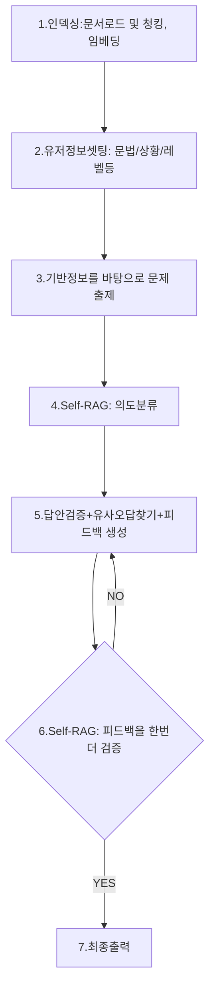

# GRAMMAR DOG

배포 전 성능을 끌어올리기 위해 해당 프로젝트의 기능개선 작업을 진행한다. 단순히 기능을 나열하는 방식에서 벗어나, **LangGraph**를 활용해 단계별 흐름을 정밀하게 제어하는 아키텍처를 구축한다. 단계별 문제가 있었던 부분은 철저하게 세부적으로 나누어 타겟팅하였다.


## 단계별 흐름 구성
현재까지의 큰 흐름이다. 문서를 로드하고, 문제를 출제하고, 피드백을 전달하는 흐름은 동일하다. 




## 인덱싱(문서로드, 청킹, 임베딩과정)
인덱싱 과정에서는 문서로드, [[청킹]], [[임베딩]] 등의 과정이 포함된다. 지난 작업에서 발생한 고질적인 문제를 해결하기 위해, 일종의 참고 문서(Reference Document)를 생성하고 이를 기준으로 문제를 출제하거나 채점을 진행하는 방식을 도입한다.

실제로 간단한 문법 기준 문서를 제작하여 피드백 생성을 지시한 결과, 별도의 모델 학습 없이도 매우 안정적인 패턴으로 결과물이 출력되는 것을 확인한다. 이는 [[프롬프팅]] 기법 중 예제를 전달하여 성능을 높이는 [[퓨샷]](Few-shot) 방식의 응용이다. 모델 전체를 튜닝하는 무거운 방식 대신, 컨텍스트 내에 명확한 기준점을 제공하는 것만으로도 실무 수준의 성능 향상을 이끌어낼 수 있는 가장 간단하고 강력한 전략 중 하나이다.

``` json
// AI를 통해 데이터 증류 과정으로 만든 문법 가이드
{
	"tag_id": "can/could_usage",
	"category": "Modals_Subjunctive",
	"rule_name": "can/could 사용법",
	"core_formula": "[can/could] + 동사원형",
	"checklist": [
		"'can'은 현재 또는 일반적인 능력을 나타낼 때 사용한다.",
		"'could'는 과거의 능력 또는 현재에 대한 공손한 요청/제안을 나타낼 때 사용한다.",
		"정중하게 요청하거나 제안할 때는 'could you...?'를 사용한다."
	],
	"wrong_example": "I can swim when I was a child.",
	"correct_example": "I could swim when I was a child."
},
{
	"tag_id": "must/have_to_usage",
	"category": "Modals_Subjunctive",
	"rule_name": "must/have to 사용법",
	"core_formula": "[must/have to] + 동사원형",
	"checklist": [
		"'must'는 강한 의무나 확신을 나타낸다.",
		"'have to'는 의무를 나타내지만 'must'보다 더 일반적인 상황에서 쓰인다.",
			"'have to'는 부정문에서 'don't/doesn't/didn't have to'로 의무의 부재를 나타낸다."
	],
	"wrong_example": "I must to go to the store.",
	"correct_example": "I must go to the store."
},
```

단순한 참고 문서 활용만으로도 성능의 유의미한 개선을 확인한 후, 더욱 공신력 있는 데이터셋 확보를 검토했다. 초기에는 시중의 전문 문법 서적이나 영작 교재 전체를 인덱싱하는 방안을 고려했으나, 다음과 같은 이유로 불가하다 판단했다.

- **라이선스 및 저작권 문제:** 상용 서적의 데이터를 무단으로 가공하여 서비스에 사용하는 것은 법적인 리스크 존재.
- **오버엔지니어링(Over-engineering) 방지:** 방대한 분량의 서적 전체를 관리하는 것은 시스템의 복잡도를 높이며, 비용 대비 실익이 낮다고 판단.
    
최종적으로는 추천을 받아 위키피디아의 **'English Grammar'** 문서를 기준점으로 선정했다. 이는 전 세계 언어학자들과 숙련된 편집자들이 _Quirk et al._ 및 _Huddleston & Pullum_ 등 권위 있는 현대 언어학 레퍼런스를 바탕으로 집대성한 **'사실상의 표준(De facto standard) 명세'**이기 때문이다.

해당 문서를 [[마크다운]] 기반으로 가공하고 최종적으로 [[JSON]] 형태의 구조화된 데이터로 변환했다. 분량이 방대하지 않으므로 무리한 [[임베딩]] 보다는 문법 항목별로 컬럼을 구성하여 RDB(Relational Database)에 적재한다. 이를 통해 피드백 생성 시점에 모델이 표준 문법 명세를 즉각적으로 참조하여 정교한 가이드를 출력할 수 있도록 아키텍처를 설계했다.


문서 임베딩 과정에서 [[BERT]](Bidirectional Encoder Representations from Transformers)와 같은 [[인코더]] 기반 로컬 모델의 활용을 고려했지만 BERT 계열은 모델의 파편화가 매우 심해, 해당 프로젝트의 도메인에 가장 적합한 모델을 찾아내고 검증하는 과정 자체가 방대한 리소스를 요구한다. (수많은 오픈소스 모델 중 프로젝트에 최적화된 선택지를 골라내는 능력이야말로 AI 엔지니어의 진정한 역량이다.)

최종적으로 본 프로젝트의 문서 로드 단계에서는 즉각적인 임베딩이 필수적이지 않다는 기술적 판단을 하였고, 불필요한 복잡도를 높이기보다, 단계별 세부기능 최적화에 집중하기로 했다.


## 유저정보 및 초기화
기존 시스템의 구조적 안정성을 유지하기 위해 하드코딩 기반의 틀을 유지하되, 사용자 경험(UX)과 직결되는 핵심 로직을 개선한다.

- **인증 프로세스 고도화:** 사용자 편의를 위해 로그인 및 회원가입 처리 과정을 간소화하고 시스템적으로 정교하게 재구성한다.
    
- **레벨 맞춤형 문법 필터링:** 기존 시스템은 초급부터 고급까지 문법 선택지에 대한 필터링이 부재하여, 초급 학습자가 난해한 문법 구조를 학습하게 되는 난이도 불균형 문제가 있었다. 이를 해결하기 위해 각 레벨에 부합하는 문법 범위를 재설정하고 **난이도 기반 필터링 로직**을 적용함으로써, 사용자가 자신의 수준에 맞는 적절한 학습 경로를 밟을 수 있도록 개선한다.

## 문제 출제

문제 출제 단계에서 가장 큰 기술적 과제는 **'유사 패턴의 반복'**과 **'레벨 미스매치'** 현상이었다. 지난 작업들을 거치며 상당 부분 개선되었으나, 실제 서비스 수준의 퀄리티를 확보하기 위해 마지막 '한 방'이 필요한 시점이었다.

### **1. 출제 다양성 확보를 위한 셋팅**
모델이 계속해서 유사한 형태의 문제만 생성하는 문제를 해결하기 위해 **Temperature(온도) 설정**을 정교하게 조정했고, 이전에 출제했던 문제들을 [[프롬프트]] 에 추가 제공하여, 모델이 동일한 단어나 상황을 반복하지 않고 새로운 문장을 창작하도록 지시했다. 가성비 모델인 **GPT-4o-mini**를 사용하고 있음에도 불구하고, 약간의 제어를 통해 대부분 적절하고 신뢰도있는 수준의 문제를 생성했다.
    

### **2. 레벨 미스매치 버그와 '프롬프트 최적화'
유저의 레벨과 전혀 다른 수준의 문제가 출제되는 경향은 단순히 "초급에 맞춰달라"는 식의 추상적인 지시만으로는 모델의 행동을 완벽히 제어할 수 없다는 한계를 드러냈다. 이를 해결하기 위해 초급부터 고급까지의 모든 가이드를 프롬프트에 한꺼번에 늘어놓는 이른바 **'프롬프트 덧칠'** 방식을 철저히 지양해야 했다. 이러한 방식은 모델의 혼란을 가중시키고 추론 효율을 떨어뜨리는 비효율적인 접근이기 때문이다.

대신 로직 단에서 레벨별 문제 출제 규칙을 명확히 정의하고 처리한 뒤, 모델에게는 현재 상황에 꼭 필요한 핵심 지침만 전달하는 방식을 택했습니다. 구체적으로는 `LEVEL_DESCRIPTION_MAP`을 활용해 해당 레벨에 부합하는 설명만 프롬프트에 동적으로 주입함으로써, 모델이 불필요한 정보에 간섭받지 않고 최적의 난이도로 문제를 생성할 수 있도록 아키텍처를 설계했다.
    

> **[레벨 난이도 규칙]**
> - **초급:** 기초 어휘 중심, 단문 위주(10~14단어), 조건절/복문 최소화
> - **중급:** 중등 수준 어휘, 1~2절 문장(12~18단어), 핵심 문법 1개 명확히 반영
> - **고급:** 대학생 수준 어휘, 2절 이상 허용(16~24단어), 뉘앙스 표현 허용

이러한 **'로직기반 제어'** 방식은 프롬프트의 길이를 줄여 응답 속도를 높이는 동시에, 모델이 각 레벨의 경계를 명확히 인식하여 훨씬 더 일관성 있는 난이도의 문제를 출제하도록 만들었다.


``` markdown
generate_question:
system: |
너는 친절하고 전문적인 영어 학습 튜터야.
주어진 학습 '레벨'과 '주제'에 맞춰, 아래 정보를 바탕으로 오늘 학습할 문법 내용을 구성해 줘.

[문법 지시 및 참고 자료]
{grammar_instruction}

[레벨 난이도 규칙]
{level_description}

위 규칙을 반드시 우선 적용하고, 규칙을 벗어나는 문장은 생성하지 마.

[매우 중요]
출제하는 '한국어 영작 문제(Question)'는 반드시 네가 선정한 '오늘의 문법(Grammar)' 패턴을 100% 정확하게 평가할 수 있어야 하며, 문법적으로 모순이 없어야 해.
또한 기존의 출제된 문제 {current_question} 와 유사한 문제를 계속 출제하지 않도록 주의하고,
완전히 새로운 단어와 상황을 창작해 줘.

흔한 교과서적인 문장(예: I am a student, I study hard, The homework is completed by the students)은 배제하고,
주어진 주제({topic})의 구체적인 세부 상황인 '{picked_situation}'을(를) 배경으로 설정해서 문제를 만들어주세요.

구체적인 등장인물이나 독특한 상황이 포함된 디테일하고 생동감 있는 문장을 만드세요.

모든 설명과 출력은 반드시 **한국어**로 작성해야 해.

다음과 같은 항목들로 명확히 구분해서 출력해줘:
1. 오늘의 문법 (Grammar)
2. 간단한 설명 (Explanation) - 원문 요약을 바탕으로 이해하기 쉽게 설명
3. 예문 (Example) - 영작 문제에 참고가 되도록 제공(반드시 번역도 같이 제공)
4. hint : 주요 (단어:뜻) 영작 문제에 대한 힌트 몇개 제시
5. 영작 문제 (Question) - 유저가 영어로 번역해야 할 한국어 문장

```

기존 아키텍처에서는 Grammar, Explanation, Example 등 특정 출력 항목을 강제하지 못하는 구조적 한계가 있었다. 이로 인해 모델이 불필요한 서술을 추가하거나 항목을 누락하는 등 출력의 일관성이 떨어지는 문제가 빈번하게 발생했습니다.

이러한 문제는 **[[LangChain]]의 [[출력파서]](Output Parser)**를 도입함으로써 간단하게 해결되었다. 프롬프트상에서 복잡하고 강압적인 지시를 내리는 대신, 코드 레벨에서 **Pydantic** 기반의 스키마를 모델과 연결하는 방식을 채택했습니다.

``` python
	class GenerateQuestionSchema(BaseModel):
	grammar: str = Field(description="오늘의 문법")
	explanation: str = Field(description="간단한 설명")
	example: str = Field(description="예문")
	hint: str = Field(description="주요 (단어:뜻) 영작 문제에 대한 힌트 몇개 제시")
	question: str = Field(description="유저가 영어로 번역해야 할 한국어 문장")
```

``` python
	chain = prompt | llm.with_structured_output(GenerateQuestionSchema)
```


## Self-RAG 의도 판정
AI 엔지니어링중 가장 큰 과제는 '[[할루시네이션]]' 을 잡는것이다. 이것은 AI가 하는 일종의 헛소리인데, 이 현상은 질문에 대한 답을 모를때 두드러진다. 아무말이나 그럴싸하게 지어내는것이다. **Self-RAG(Self-Reflective Retrieval-Augmented Generation)** 은 RAG 의 각 단계별로 세부적으로 개입해서 해당 답변이 적절한지 판단하고, 의도를 분석하고, 답변이 유용한지, 근거가 있는지 등의 일종의 자아성찰을 통해 최선을 결과를 내는 과정이다. 

>2023년 Akari Asai 등이 발표한 논문 *<Self-RAG: Learning to Retrieve, Generate, and Critique through Self-Reflection>

### "그렇다면 이 복잡한 단계별 로직을 일일이 구성해야되는가?"
Self-RAG 을 위해 사전 학습된 베이스 모델이 있지만(Self-RAG-7B 등) 해당 프로젝트에서는 open ai(api) 계열의 모델을 사용하므로, LangGraph의 각 노드(단계) 별로 개입해서 프롬프팅을 통해 작업을 진행하기로 했다. 

다음은 응용의 영역이다. 단계별로 어떤 판단, 검증 절차를 개입시킬지 검토한뒤 세부적으로 작업한다. 첫번째로 '유저의 질문' 에 대한 의도 판단이다. 본 프로젝트는 영어학습을 목표로 진행하기 때문에, "오늘 날씨 어때?" 같은 쓸데없는 질문에 답변할 가치가 없다. 몇가지 의도를 구분하여 라우팅 로직을 구현했다. 

``` python
# 1. 의도 분류
classify_prompt = PROMPTS["retrieve"]["classify"]
classify_chain = ChatPromptTemplate.from_template(classify_prompt) | llm.with_structured_output(IntentSchema)
intent_result = classify_chain.invoke({
	"current_input": state["current_input"]
})
```

``` markdown
classify: |
유저의 입력을 분석하고 분류해줘.
유저 입력: {current_input}

분류 기준:
1. Intent: 다음 중 하나로 분류해.
- 'new_question': 유저가 명시적으로 다른 문제나 새로운 영작 문제를 내달라고 요구하는 경우 (예: "다른문제", "패스", "다른 문장")
- 'unrelated': 영어 학습과 전혀 무관한 질문이나 대화 (예: "안녕", "오늘 날씨 어때", "배고파")
- 'question': 영작 시도와 무관한 일반적인 영어 문법, 단어, 학습 방법에 대한 질문인 경우 (예: "현재완료가 뭐야?", "이 단어 뜻 알려줘")
- 'translation': 출제된 한국어 영작 문제에 대해 영어로 번역/작문을 직접 시도한 경우 (기본)
```

마찬가지로 출력 파서를 추가하여 출력 타입을 고정시켰다.

``` python

# 1. 출력 스키마 정의 (Pydantic)

class IntentSchema(BaseModel):
	intent: Literal['new_question', 'unrelated', 'question', 'translation'] = Field(
		description="유저의 입력 의도 분류"
	)

```

1차적으로 명확한 의도를 분석한뒤, Intent = translation 일때만 다음 로직을 타도록 구성하였다. (물론 100% 필터링 된다는 보장은 없다.)

'의도 판정' 다음은 일종의 점수 매기기 단계이다. 기존 로직에서는 의도판정과 점수부여, 정답 오답 판단 등 복합 문제를 한 단계에서 전부다 처리 하고 있었기 때문에 해당 로직의 신뢰도가 떨어진다고 판단했다. 따라서 각각 단계를 세부적으로 나누고, 프롬프팅도 최소화 하였다. 

쉽게말해 점수 부여는 '사용자의 영작'과 '출제된 문제'를 기준으로 채점하고, 1~10점까지의 점수를 주는 형태이다. [[리랭킹]] 개념을 학습하던중 응용을 해봤다. 이렇게 점수를 부여했을때의 장점은 오답 검증에 있어서 어느정도의 텐션을 부여할수 있다는것이다. (예를 들어 '7점이상은 정답처리한다' 와 같은) 

``` python
# 2. 정답 평가 (의도가 번역인 경우에만)
# 받아온 결과를 파싱하여 의도, 정답 인정 기준 점수, 오답 예상 태그를 추출

if intent == "translation":
pre_eval_prompt = PROMPTS["retrieve"]["pre_eval"]
eval_chain = ChatPromptTemplate.from_template(pre_eval_prompt) | llm.with_structured_output(ScoreSchema)

eval_res = eval_chain.invoke({
	"current_question": state.get("current_question", "없음"),
	"current_input": state["current_input"],
	"gen_question_desc": state.get("gen_question_desc", ""),
	"gen_question_example": state.get("gen_question_example", ""),
	"gen_question_hint": state.get("gen_question_hint", "")
})

score = eval_res.score
expected_tag = eval_res.tag

print(f"[RetrieveNode] 평가 사유: {eval_res.reason}")

if score >= CORRECTNESS_THRESHOLD:
is_correct = True

print(f"[RetrieveNode] 결과 -> 의도: {intent}, 정답여부: {is_correct} (점수: {score}), 예상태그: {expected_tag}")
```

초기에는 단순 출제된 문제만을 input 으로 전달하여 정답/오답을 판정했으나, 아무래도 판단력이 떨어지는 문제가 있었다. 이번 작업에서는 '출제된 문제', '예시', '힌트' 등 판단에 참고할 모든 파라미터를 전달하도록 구현하여, 판단에 신뢰도를 높히는 작업을 진행했다. 

다음 단곈느 '유사오답 조회'이다. 해당 프로젝트의 핵심로직으로 (일종의 오답노트처럼 활용하려고 했다.) 2가지 방식으로 오답을 가져오도록 작업했다. 첫번째는 단순 문법 태그 기준으로 RDB 에서 서칭하는것이다. 

``` python
# 출제 문법 tag 기준으로
# [A] target_grammar(tag_id) 기준 최신 오답 1개

target_grammar = state.get("target_grammar", "")

if target_grammar:
	tag_hits = search_history_by_tag(
		user_id=state["user_id"], 
		tag_id=target_grammar, limit=1
	)

if tag_hits:
	collected.append(("tag", tag_hits[0]))
	print(f"[디버깅] [A] tag검색 hit: {tag_hits[0][0]} ({tag_hits[0][2]})")

else:
print(f"[디버깅] [A] tag검색 hit 없음 (tag_id={target_grammar})")
```

``` SQL
	SELECT original_sentence, corrected_sentence, grammar_point, explanation
	FROM mistake_history
	WHERE user_id = %s
	AND grammar_point ILIKE %s
	ORDER BY created_at DESC
	LIMIT %s
```

1차 적으로 검색을 마친후, 2차 검색은 [[vector db]]에서 유사도 검색을 통해 유저의 질문(영작)과 의미 상으로 가장 유사한 오답을 찾아내어 가져오는 로직이다. 이렇게 해서 조회된 두건의 오답문장은 최종 피드백 단계로 전달되어 풍부한 출력을 만들어 내도록 구성하였다.

``` python
cur.execute("""
	SELECT original_sentence, corrected_sentence, grammar_point, explanation
	FROM mistake_history
	WHERE user_id = %s
	ORDER BY
	(1 - (embedding <=> %s::vector)) +
	CASE WHEN grammar_point ILIKE %s THEN 0.5 ELSE 0 END DESC
	LIMIT %s
""", (user_id, query_vector, f"%{expected_tag}%", limit))
```

또한 의미기반검색에 이전에도 틀린 문법이었다면(grammar_point) 해당 건에 가중치를 부여하여, 최종 후보군을 줄이는 작업을 진행했다.(일종의 리랭킹)


## 피드백
기존의 피드백 단계에서도 한번에 여러가지일을 처리하는 고질적인 문제를 해결하려고 노력했다. 정확하고 풍부한 피드백을 전달하기 위해서는 다양한 정보가 필요했다. 문법기준, 출제된 문제, 유저의 입력, 예문, 힌트, 오답히스토리 등 사전에 만들어진 거의 모든 정보를 input 으로 [[프롬프트]]에 전달하도록 구현했다. 토큰량이 증가하지만, 정보가 많을수록 좋은결과가 나왔다. 

특히 피드백 단계에서 맨 처음 만들어두었던 가이드 문서가 빛을 발했다. 이 문서정보를 기준으로 문법과 유저의 문장을 가이드하도록 구현했다. 아래의 grammar_reference 라는 부분이 해당 문법기준 의 가이드 문서정보 이다.(사전에 RDB에서 조회하여 전달) 

``` markdown
translation_analysis: |
너는 유저의 영어 문장을 분석하는 냉철하고 정확한 AI 영어 튜터야.
기준 문서를 통해 유저의 영어 문장을 분석하고, 오류를 판단해.

[문법 기준 문서]
{grammar_reference}

[출제 컨텍스트]
- 출제 설명: {gen_question_desc}
- 출제 예문: {gen_question_example}
- 출제 힌트: {gen_question_hint}

Step 1. 출제된 한글 문제({current_question})와 유저의 영어 입력({current_input})을 비교 분석해.

Step 2. [문법 기준 문서]와 [출제 컨텍스트]를 함께 참고해 유저 답변의 문법적 오류를 판단해. (기준에 없는 사실을 지어내지 마!)

[주의사항]
- 출제 컨텍스트에 제시된 의도와 제약을 확인하고, 이를 우선 반영해서 판단해.
예) 출제 컨텍스트에 to부정사를 사용한 예문이 있으면, to부정사에 대해서만 검증해야돼. (더 좋은 문법 기준으로 판단해서 감점을 주면 안돼.)

[출력 지시사항]
아래 항목들을 명확히 구분해서 출력해줘:
- Corrected Text: [교정된 완벽한 원어민 영어 문장]
- Grammar Tag: [핵심 문법 오류 태그 단어 1개 (짧은 영어 단어)]
- Explanation: [오답 이유에 대한 간단하고 명확한 한국어 설명 (틀린 이유 팩트만 전달)]
- Better Expression: [원어민들이 더 자주 쓰는 자연스러운 구어체 대안 1개 (선택 사항)]
```

'grammar_reference'(가이드문서) 를 넣게된 이유는 초기버전의 피드백 안정성이 굉장히 떨어졌기 때문이다. 특히나 [[gpt-4o-mini]] 같은 경량 모델을 사용할때는 그럴듯하게 만들어낸 틀린 피드백을 하는경우가 많았다. '언어' 는 본래 일정한 패턴이 존재하지만, 다양한 조합 가능한 부분이라 판정 시점에 추론이 많이 필요한 부분이다. 그래서 최종 'fewshot' 형태의 기준점을 제공하여, 피드백 생성에 기준점을 첨가하였다. 그 이후로 성능이 대폭 증가하였다.

## Self-RAG 깐깐한 심사관
전단계에서 만들어진 최종 피드백을 마지막으로 한번 더 검사하는 단계이다. 자체적인 심의과정을 통해 출력의 신뢰도를 높이고자 구성되었다. 해당 단계에서 통과하지 못하면, 심사관의 의견과 함께 다시 '피드백단계' 로 돌아가서 문장을 재구성하도록 처리했다. 이러한 라우팅은 [[langgraph]]의 편리함 덕분에 쉽게 구현할수 있었다. (langgraph는 이런 단계별 라우팅 구현에 최적화 되어있다.) 

기존 버전에서의 문제는 이 '심사관' 의 기준이 너무 깐깐하다는 문제가 있었다. 예를 들어 문법적으로 충분히 허용되는 범위이지만, 네이티브가 잘 안쓰는 표현이라면 불합격 판정을 한다던가 하는 등이다. 유연한 프롬프팅과 사전정보를 최대한 전달하여 이런부분도 개선되었다. 

불합격 판정이 무한으로 발생하는 불상사를 대비해 최대 재시도 횟수는 3회로 고정하였다. (비용폭탄방지) 기존에 llm의 temp가 0으로 셋팅되어있었지만, 이 부분은 정확한 심사를 위해 필요하다고 판단했고, 프롬프트를 일부 조정하는것 만으로 원하는 결과를 출력하였다. 

``` markdown
verify:
qa_prompt: |
너는 영어 교육 서비스의 최종 검증관(QA)이야.
튜터의 피드백이 옳바른 판단을 포함하는지만 체크하면돼.

[문법 기준 문서(핵심 가이드)]
{grammar_reference}

[상황 정보]
- 출제 문제: {current_question}
- 유저 입력: {current_input}
- 튜터 피드백: {feedback}

[판단 기준 - 이 기준 외의 사소한 차이는 무시하고 PASS 처리해]
1. 의미 왜곡 여부: 튜터의 피드백이 [출제 문제]의 의도를 완전히 벗어나는가?
2. 핵심 문법 준수: [문법 기준 문서]에 명시된 핵심 공식이 피드백에 정확히 반영되었는가?

(주의: 기준 문서에 없더라도 관사(a/the) 추가나 명사 복수형 교정 등 '일반 문법'을 추가로 바로잡은 것은 적극 권장하며 PASS 처리함)

3. 근거 없는 비판(Hallucination): 중요!!! 유저가 틀리지 않은 부분을 틀렸다고 하거나, 존재하지 않는 문법 규칙을 지어내어 설명하는가?

[출력 규칙 - 예외 없음]
- 위 3가지 중 '치명적인 문제'가 없다면: 무조건 딱 한 단어 PASS 만 출력.
- 치명적인 문제가 있다면: "기준 [번호] 실패: [이유]" 형식으로 한 줄만 출력.
(예: 기준 2 실패: to부정사 뒤에 동사원형이 아닌 -ing가 쓰임)

※ 경고: 유연성하게 대처하라. 말투가 이상하거나, 표현이 조금 다르거나, 기준 문서 외의 추가 교정을 제공했다는 이유로 실패 처리를 하지 마라. 유저에게 이로운 피드백이면 PASS 처리한다.

```


## 트러블 슈팅
대표적으로 몇가지 이슈사항을 정리한다.

### **출제 문제의 난이도 불균형 (Level Balancing)**
- 단순히 `{level}` 파라미터(초급, 중급, 고급)만 전달했을 때는 모델이 의도한 난이도를 전혀 맞추지 못하는 현상이 발생했다. 초등 수준의 초급 문제를 기대했으나 고등학교 수준의 문장이 생성되는 등 밸런스가 무너졌다. 이를 해결하기 위해 프롬프트에 의존하는 대신, **로직 단에서 레벨별 정확한 지침(어휘 범위, 문장 길이 등)을 명확히 정의하여 전달**함으로써 해결했다.


``` python
# 레벨별 출제 설명 (프롬프트 주입용 압축 규칙)
LEVEL_DESCRIPTION_MAP: Dict[str, str] = {
	"초급": "기초 어휘(A1~A2) 중심, 단문 위주(10~14단어), 조건절/복문 최소화, 힌트 4개 내외",
	"중급": "중등 수준 어휘(A2~B1), 1~2절 문장(12~18단어), 핵심 문법 1개 명확히 반영, 힌트 2~3개",
	"고급": "대학생 수준 어휘(B1~B2), 2절 이상 허용(16~24단어), 뉘앙스 표현 허용, 힌트 1~2개",
	"네이티브": "비즈니스/학술 맥락 어휘(C1), 고급 복문 허용(20~30단어), 힌트 최소화(0~1개)"
}
```

``` python 
[레벨 난이도 규칙]
{level_description}
```

### **복합 프롬프트의 한계와 지능 저하**
- 한 번의 프롬프트에서 의도 파악, 정답 판정, 피드백 생성을 모두 처리하려 하면 경량 모델일수록 '엉터리 답변'을 내놓을 확률이 급격히 높아지는 경우가 있다. 하나의 모델에게 너무 많은 짐을 지우는 대신, **LangGraph를 활용해 단계별 노드를 구성**하여 각 단계가 단일 임무에만 집중하도록 설계함으로써 추론의 정확도를 높였다.

### **출력 형식의 강제성 부족**
- 단순히 "JSON으로 출력해줘"라고 지시하는 것만으로는 출력의 강제력을 확보하기 어렵다. 불필요한 서술형 답변이 포함되거나 파싱 에러가 발생하는 문제를 방지하기 위해 **출력 파서(Pydantic) 세팅을 필수적으로 적용**하여 데이터의 규격을 고정했다.

### **정보 부족으로 인한 '앵무새 현상'**
- 모델이 같은 문제만 반복하거나 뻔한 피드백을 내놓는 현상은 대부분 '판단 기준'이 부족할 때 발생한다. 이를 방지하기 위해 **One-shot 또는 Few-shot 형태의 적절한 예문과 참조 정보를 추가로 제공**하여 해결했다.

### **임베딩 모델 간 불일치 이슈**
- 임베딩은 문자를 수치화하는 과정이며, 모델마다 이를 수치화하는 구조가 다르다. 임베딩 시 사용한 모델(A)과 벡터 검색 시 사용한 모델(B)이 다를 경우, 의미상 전혀 무관한 결과가 도출될 확률이 높다. 따라서 **전체 파이프라인에서 동일한 임베딩 모델을 사용하도록 일관성을 유지**하는 것이 벡터 검색 기반 로직에서 주의해야 할 포인트이다.

## 배포
성능 개선이 완료된 프로젝트를 실제 사용자가 접속할 수 있는 환경으로 이전했다. **'저비용 고효율'**과 **'관리의 편의성'**을 최우선으로 고려하여 **Vercel - Supabase - Google Cloud Run**으로 이어지는 서버리스 아키텍처를 구성했다.

- **1. 프론트엔드: Vercel (Next.js)**
-  **2. 데이터베이스: Supabase (PostgreSQL)**
- **3. 백엔드: Google Cloud Run (Python/FastAPI)**

배포과정은 크게 어렵지 않았다. Next.js 기반으로 사실상 표준인 vercel(next.js 제작사) 을 통해 프론트엔드를 배포하기로 결정했다. 

[[vercel]]의 장점은 굉장히 쉽고 빠르게 배포할수 있고, 개인적인 용도 (상업적X)라면 사실상 무료로 호스팅을 제공한다. 또한 github에 소스를 push 하는것 만으로 배포가 자동 처리된다. 

>**Vercel은 Next.js의 제작사**입니다. 따라서 Next.js의 새로운 기능이 발표될 때 이를 가장 완벽하게 지원하는 인프라 역시 Vercel입니다. Vercel의 장점은 기능을 설정 없이(Zero Config) 쉽고 빠르게 바로 실 서비스 환경에 배포할 수 있는 환경을 제공합니다.

[[supabase]] 는 로컬 테스트 작성시 현재 postgresql을 사용했기 때문에, 무료로 사용할수 있는 [[서버리스]] 환경구축을 위해 자연스럽게 supabase를 생각하게 되었다. firebase 처럼 [[BasS]]형태의 서비스를 제공하며, 장점은 rdb 를 그대로 서버리스로 구현할수 있다는 것이다. 이 또한 일정량 무료이다. 

[[firebase]] - firestore 를 사용할때 힘들었던 부분인, 직접 쿼리를 할수 없다는것([[nosql]] 방식) 테이블간의 조인을 할수 없기 때문에 데이터베이스 구조부터 설계를 새롭게 해야된다는점 등 여러가지로 불편한 점이 많았다. supabase는 postgresql을 기준으로 db 서비스를 제공하기 때문에 불편했던 부분이 상당부분 해소되었다.

python, fastAPI 에 대한 환경구축이 생소하다보니 어려움을 겪었다. [[AWS EC2]], [[Google cloud run]] 이 최종 후보였다. (무료기준) AWS 는 1년동안 무료티어를 제공해주지만, 성능이 낮고, 콜드스타드 문제 등, 설정이 골치아픈문제를 이유로 'Google cloud run' 을 사용하기로 했다. 무료로 제공하는 할당량이 초과되면 과금되는 형태이다. 설정만 잘하면 개인 테스트용도로는 충분하다고 판단되었다. 

> Cloud Run은 Google의 확장성이 뛰어난 인프라에서 코드, 함수 또는 컨테이너를 실행하는 완전 관리형 애플리케이션 플랫폼입니다. 컨테이너 이미지를 빌드할 경우 모든 프로그래밍 언어로 작성된 코드를 Cloud Run에 배포할 수 있습니다.


가장 편리했던 점은 로컬에서 작업하던 백엔드 소스를 깃허브에 올리고, 바로 연동시키면 해당 [[Docker]] 파일 설정에 따른 셋팅을 자동으로 수행한다. 또한 requirement 파일만 제대로 작성하면 알아서 프레임워크 등 필요한 작업을 사전에 셋팅하고 빌드까지 진행된다. 로컬에서 사용하던 환경변수 등의 작은 문제가 있었지만, 간단하게 처리하고 서비스를 배포했다.
